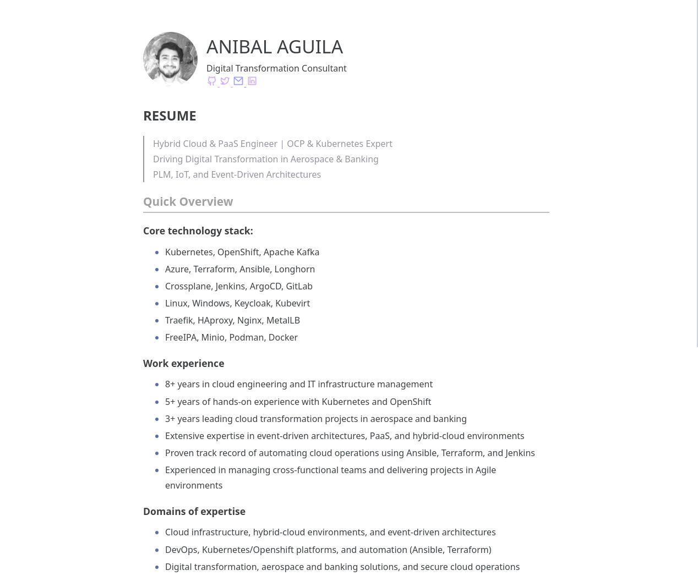

# Standard

> A resume standard theme powered by [Zola](https://getzola.org).
>> See a live preview [here](https://aa.resume.rs).



## Features

- [x] Clean and Clear 
- [x] Always Updated
- [ ] Linkedin Mirror

## Installation:

1. Preparation:

```bash
# Setup your standard resume in a clean directory.

mkdir tintin-resume & cd tintin-resume
zola init
   # Welcome to Zola!
   # Please answer a few questions to get started quickly.
   # Any choices made can be changed by modifying the `config.toml` file later.
   # > What is the URL of your site? (https://example.com): https://aa.resume.rs
   # > Do you want to enable Sass compilation? [Y/n]: Y
   # > Do you want to enable syntax highlighting? [y/N]: N
   # > Do you want to build a search index of the content? [y/N]: N
git init & git add .
git submodule add https://github.com/resume-rs/themes-standard themes/standard
```

2. Configuration:

```toml
# Add the following to the top of your `config.toml`

theme = "standard"

```

3. Publish:

```bash
# Build and Deploy:
# --- Testing: copy the example content and test it.

cp -r themes/standard/content/* content/
zola serve

# GitHub Pages: with custom domain.

# ---  Create the directory structure if it doesn't exist
mkdir -p .github/workflows

# ---  Create the workflow file using a heredoc
cat << 'EOF' > .github/workflows/build-and-deploy.yaml
name: Zola on GitHub Pages

on:
  push:
    branches:
      - main

jobs:
  build:
    name: Publish site
    runs-on: ubuntu-latest
    steps:
      - name: Checkout main
        uses: actions/checkout@v4

      - name: Build and deploy
        uses: shalzz/zola-deploy-action@v0.19.2
        env:
          GITHUB_TOKEN: ${{ secrets.GITHUB_TOKEN }}
EOF


# ---  Create a CNAME record for DNS resolution
cat << 'EOF' > static/CNAME
aa.resume.rs
EOF

# ---  Push to git
git add .
git commit -m 'first commit ~~'
git remote add github git@github.com:anibal-aguila/resume.git
git push github main


```
